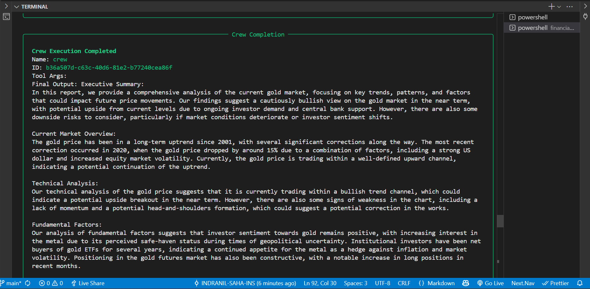
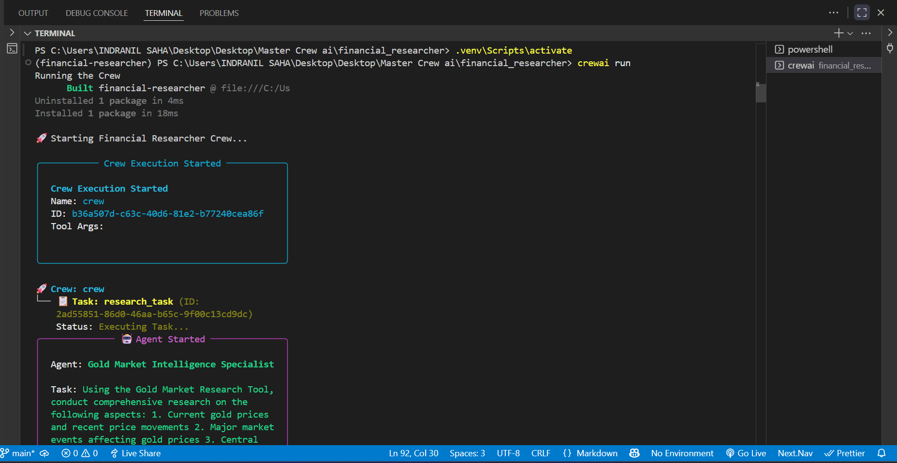
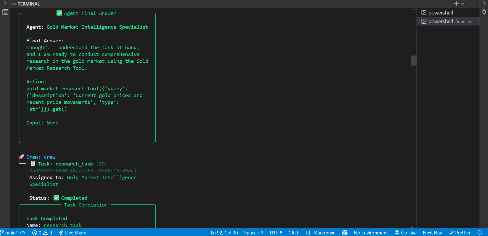
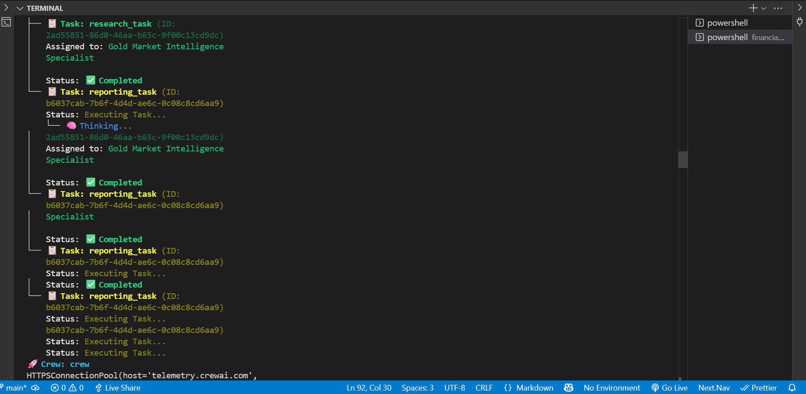
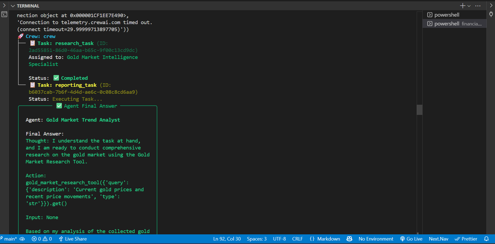

# Gold Market Analysis AI Crew

An intelligent AI-powered system for comprehensive gold market analysis, built using CrewAI. This project combines specialized AI agents with real-time market data to deliver in-depth gold market insights and analysis.

## Features

- **Real-time Gold Market Research**: Automated collection of current gold prices, trends, and market movements
- **Comprehensive Analysis**: Multi-agent system analyzing technical indicators, market sentiment, and economic factors
- **Expert Insights**: Integration with Serper API for gathering latest expert opinions and market analysis
- **Automated Report Generation**: Professional financial reports with actionable insights

## System Components

### 1. AI Agents
- **Gold Market Intelligence Specialist**: Gathers and processes market data
- **Gold Market Trend Analyst**: Analyzes patterns and market correlations
- **Gold Market Report Specialist**: Creates comprehensive reports

### 2. Tools
- **Gold Market Research Tool**: Custom tool for gathering market data using Serper API
- **Automated Analysis Pipeline**: Sequential processing of market data

## Installation

1. **Prerequisites**
   - Python 3.10-3.13
   - Ollama (for LLM support)
   - CrewAI CLI

2. **Initial Setup**
   ```bash
   # Install CrewAI CLI if not already installed
   pip install crewai-tools

   # Create new CrewAI project
   crewai create crew financial_researcher

   # Project will be created with basic structure 
   and .venv/ ,if not already created , create it manually with name as .venv
   cd financial_researcher
   ```

3. **Install Additional Requirements**
   ```bash
   # Install required packages
   pip install langchain_ollama requests

   # Update pyproject.toml with new dependencies
   # Add these under [project.dependencies]:
   # "requests"
   # "langchain_ollama"
   ```

4. **Verify Dependencies**
   The `pyproject.toml` should include:
   ```toml
   [project]
   dependencies = [
       "crewai[tools]>=0.203.1,<1.0.0",
       "requests",
       "langchain_ollama"
   ]
   ```

3. **Configuration**
   Create a `.env` file in the project root:
   ```env
   SERPER_API_KEY=your_serper_api_key_here
   ```

## Usage

1. **Start Ollama**
   ```bash
   # Ensure Ollama is running locally on port 11434
   # Default URL: http://localhost:11434
   ```

2. **Set Environment Variables**
   ```bash
   # Ensure your .env file is configured with:
   SERPER_API_KEY=your_serper_api_key_here
   ```

3. **Run the Analysis**
   ```bash
   # Activate your virtual environment if not already activated
   source .venv/bin/activate  # On Windows use `.venv\Scripts\activate`
   # Using CrewAI CLI
   crewai run

   # This will automatically:
   # - Use your virtual environment
   # - Load configurations from pyproject.toml
   # - Execute the crew with proper dependencies
   ```

3. **View Results**
   - Find the generated report in `financial_report_{timestamp}.md`

## Sample Outputs

### Terminal Execution
```
🚀 Starting Financial Researcher Crew...

╭──────────────── Crew Execution Started ─────────────────╮
│                                                         │
│  Crew Execution Started                                 │
│  Name: crew                                            │
│                                                        │
╰─────────────────────────────────────────────────────────╯

🚀 Crew: crew
└── 📋 Task: research_task
    Status: Executing Task...
```

### Generated Reports
You can find example outputs in:
- [`financial_report.md`](financial_report.md) - Latest analysis report
- [`financial_report_20251108_142057.md`](financial_report_20251108_142057.md) - Timestamped report example

### Sample Report Sections


#### Key Sections Include:
- Executive Summary
- Current Market Overview
- Technical Analysis
- Fundamental Factors
- Market Sentiment Analysis
- Supply-Demand Dynamics
- Risk Factors
- Market Outlook
- Actionable Insights

### Analysis Process

#### 1. Data Collection Workflow

- Market Intelligence Specialist initialization
- Serper API integration
- Real-time gold market data gathering
- Historical price data collection
- Expert opinion aggregation

#### 2. Analysis Pipeline

- Raw data processing
- Technical indicator calculation
- Pattern recognition
- Sentiment analysis
- Correlation studies with other assets

#### 3. Expert Analysis Process

- Trend identification
- Market sentiment evaluation
- Supply-demand analysis
- Risk factor assessment
- Future projection modeling

#### 4. Report Generation Pipeline

- Data synthesis
- Key findings extraction
- Report structuring
- Recommendation formulation
- Final document compilation

## Project Structure

```
financial_researcher/
├── src/
│   └── financial_researcher/
│       ├── config/
│       │   ├── agents.yaml    # Agent definitions
│       │   └── tasks.yaml     # Task workflows
│       ├── tools/
│       │   └── custom_tool.py # Gold market research tool
│       ├── crew.py           # CrewAI setup
│       └── main.py           # Entry point
└── README.md
```

## Configuration

### Customizing Analysis
- Modify `agents.yaml` to adjust agent behaviors and expertise
- Update `tasks.yaml` to change analysis focus areas
- Edit `custom_tool.py` to enhance data collection capabilities

## Development

To extend the system:
1. Add new tools in `tools/`
2. Define new agents in `agents.yaml`
3. Create new tasks in `tasks.yaml`

## Dependencies

- crewai[tools]
- langchain_ollama
- requests

## License

MIT License

## Contributing

1. Fork the repository
2. Create a feature branch
3. Submit a pull request

---

For more information about CrewAI, visit [crewAI documentation](https://docs.crewai.com)
